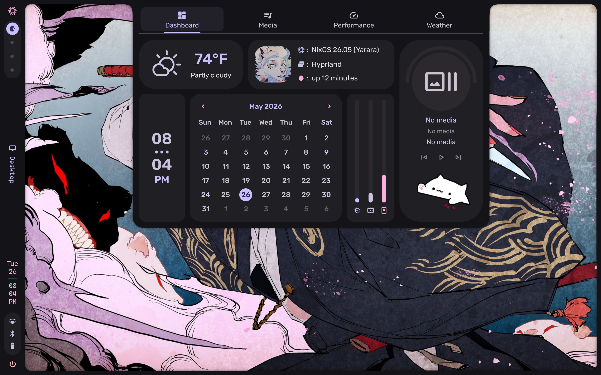
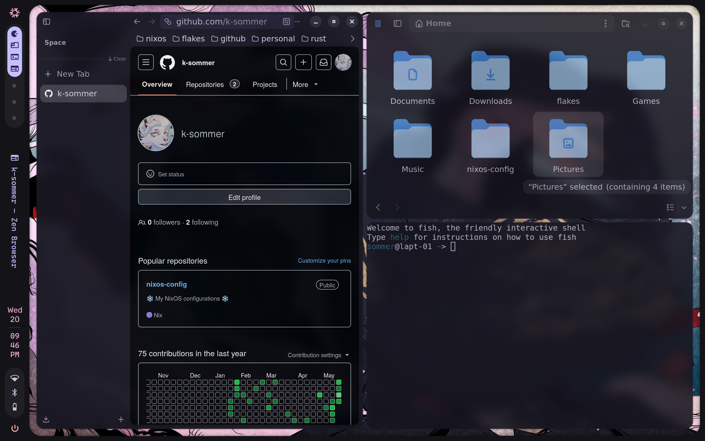

# ❄️ NixOS configuration
This repo contains my NixOS configuration files used to build and manage my system environments across multiple device types. 
# 🏗️ Structure
Like others I have structured my files in a modular manner, focusing on using toggles to enable certain features (e.g. desktop environment, steam, dev tools, etc). The /modules/nixos directory is used for the core configuration modules, while the /modules/home directory is used for home-manager modules.
# ⚪ Feature toggles
| Toggles |Description |
|---------|------------|
|```features.dev.enable```| Installs vscodium and obisidan packages |
|```features.starCitizen.enable``` | Installs the RSI launcher and makes changes to the kernel for stability |
|```features.steam.enable``` | Installs the steam client and gamescope |
|```features.nvidia.enable``` | Installs the current Nvidia drivers|
|```features.nvidiaPrime.enable``` | Installs the current Nvidia drivers and enables prime sync. The bus ID's are currently hardcoded|
# 📸 Screenshots



# ✔️ To Do
- [ ] Enable secrets implimentation using either sops-nix or agenix
- [ ] Remove hardcoded bus ID's in favor of using mkOption