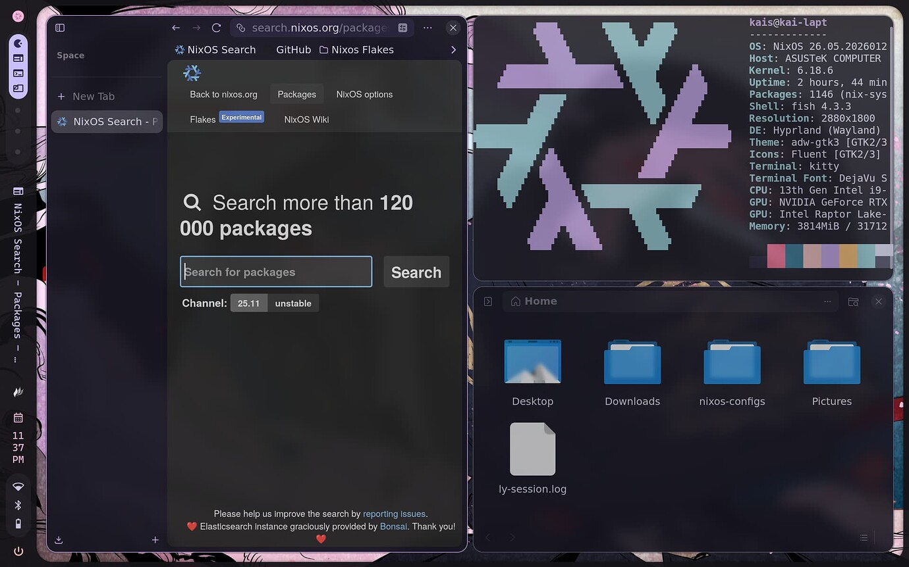

# NixOS Systems Configuration
This repository contains a NixOS systems configuration designed to manage a varied fleet of linux devices from a single source of truth. 

# Deployment staging
```lapt-01``` is leveraged as a staging environment to build, evaluate, and test system updates before utilizing rsync and ssh to deploy zero-downtime rolling upgrades to live nodes. Even when an end user is gaming!

# Interface
[Hyprland](https://github.com/hyprwm/Hyprland) and [Caelestia-shell](https://github.com/caelestia-dots/shell) are used in favor of the usual desktop environment as to eliminate any unnecessary packages or services. [Jovian NixOS](https://github.com/Jovian-Experiments/Jovian-NixOS) is used on ```held-01```, ```desk-01```, and ```desk-02``` for a SteamOS like experience, while still being able to switch to the hyprland desktop. 

## To Do!
- [ ] Impliment secrets (sops or agenix)
- [ ] Remove hardcoded bus ID's in the nvidiaLaptop feature toggle in favor of ```mkOption```
- [ ] Add more comments and information for explaining the logic behind the decisions made
- [ ] Change logout button on Caelestia-shell to switch back to the steam ui
- [ ] Start using branches for the sake of seperating a staging and production environment
 
# Screenshots


