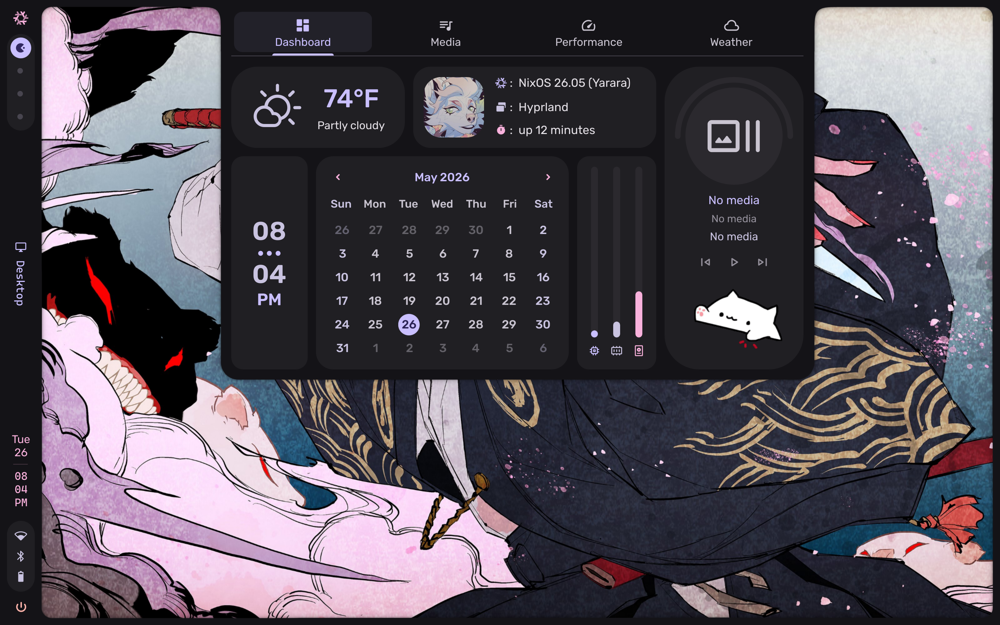
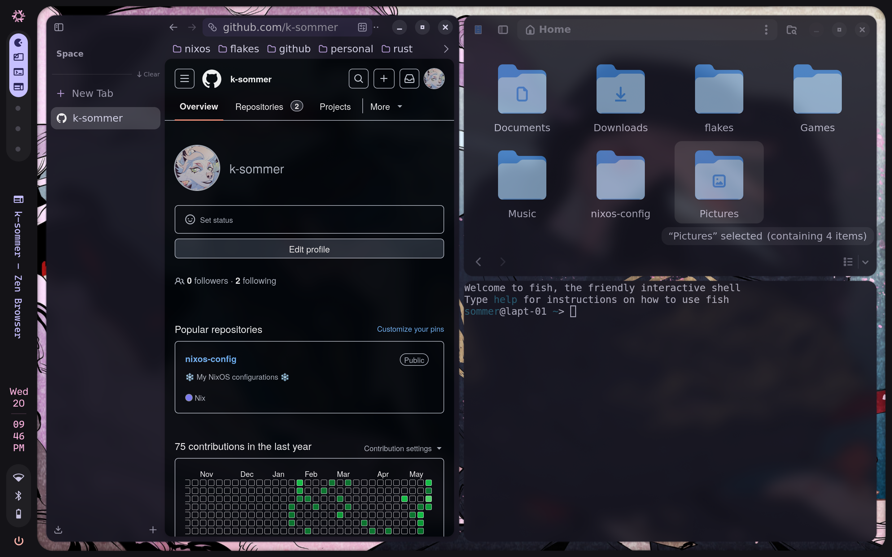

## Welcome to my NixOS systems flake! 
While this repository is not meant to be a template for others to start from, I hope you can find some inspiration from it. 

# Modules
Currently most nixos modules are either imported into each host's configuration.nix file, or in the case of the gaming.nix module there are feature toggles for various gaming-related settings. 

The home modules only apply to the single user in the configuration at this time.

# Structure
```
nixos-config
|-- flake.nix
|-- flake.lock
|-- LICENSE
|-- README.md
|-- dotfiles
|   |── caelstia
|   |   |-- cli.json
|   |   └── shell.json
|   └── hypr
|       |-- modules
|       |   |-- hosts
|       |   |   |-- desk-01.lua
|       |   |   |-- held-01.lua
|       |   |   └── lapt-01.lua
|       |   └── binds.lua
|       └── hyprland.lua
|-- hosts
|   |-- desk-01
|   |   └── configuration.nix
|   |-- held-01
|   |   └── configuration.nix
|   └── lapt-01
|       └── configuration.nix
|-- modules
|   |-- home
|   |   |-- home.nix
|   |   |-- programs.nix
|   |   |-- stylix.nix
|   |   └── zen.nix
|   └── nixos
|       |-- base.nix
|       |-- default.nix
|       |-- dev.nix
|       |-- gaming.nix
|       |-- gui.nix
|       └── jovian.nix
|-- secrets
|   |-- secret1.age
|   └── secrets.nix
```

# gui.nix Components
|    |NixOS|
|----|-----|
|Window Manager|[Hyprland](https://github.com/hyprwm/hyprland)|
|Status Bar / Notifier / Launcher / lockscreen|[Caelestia-Shell](https://github.com/caelestia-dots/shell)|
|Stylix Color Scheme|[Rose-Pine](https://github.com/rose-pine)|
|File Manager|Nautilus|
|Terminal|[Kitty](https://github.com/kovidgoyal/kitty)|
|Shell|[Fish](https://github.com/fish-shell/fish-shell)|
|Image Viewer|Eye of Gnome|

# Screenshots



